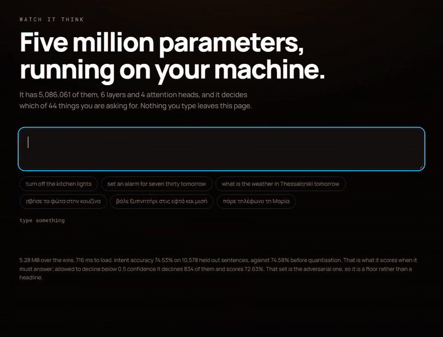

# watch it think

### A language model, running entirely in your browser, with the lid off.

Type a sentence. A five million parameter model decides which of 44 things you
are asking for, tags the words that carry the details, and shows you every one
of the 24 attention patterns it used to get there. No server, no API key,
nothing leaves the page.

Most demonstrations of a model show you the answer. This one shows the working.



That is the real page, recorded by `npm run capture` from a real browser. The
sentence is Greek because the model is bilingual: `σβήσε τα φώτα στην κουζίνα`
is "turn off the kitchen lights".

---

## Run it

```bash
npm install
npm run dev      # then open the address it prints
```

That is the whole thing. The model is committed to this repository, so there is
nothing to download, no key to get and no service to sign up for.

---

## What it is

A router: the part of an assistant that reads what you said and decides what you
wanted. 5,086,061 parameters, 6 layers, 4 attention heads, a 4,000 token
vocabulary, 64 token context. It ships as 5.28 MB of int8, which is 3.86 times
smaller than the float model it was quantised from.

It was trained from random initialisation on a corpus its own repository
generates. No pretrained weights, nothing distilled from a larger model. The
training code, the data generator and its own benchmarks are at
**[github.com/Broikos-Nikos/bslm](https://github.com/Broikos-Nikos/bslm)**.

The three things the page draws:

- **The intent.** 44 candidates with their probabilities, so you see what it
  nearly chose as well as what it chose.
- **The slot tags.** Which words carry the room, the time, the person.
- **The attention.** 24 fields, one per layer and head. A bright row is a token
  that made up its mind; a flat row is one that did not. They are not the same
  as each other, and finding the head that watches the verb is the activity.

---

## The numbers

Measured on 10,578 held out sentences, the adversarial split, which is built
from templates and synonyms held out of training:

| | int8, what ships | float32 |
|---|---|---|
| intent accuracy | **74.53%** | 74.58% |
| intent accuracy, allowed to decline | **72.63%**, declining 834 | |
| slot tag accuracy | 97.28% | 97.28% |
| intent and every tag correct | 69.86% | 69.97% |

Both accuracy figures or neither. 74.53% is what it scores when it must answer.
The assistant these weights ship in declines below 0.50 confidence rather than
guessing, and scored that way it gets 72.63% and says nothing on 834 of the
10,578.

**The tag figure needs a baseline and here it is:** predicting `O` for every
word scores 74.98%, because most words carry no slot. 97.28% is good, and it is
not as good as it looks next to the intent number.

Latency, int8, native onnxruntime at one thread, 200 repeats a length:

| tokens | 6 | 14 | 32 | 64 |
|---|---|---|---|---|
| median | 0.58 ms | 0.97 ms | 1.92 ms | 3.70 ms |

Attention is quadratic in the token count, so there is no single number. In the
browser, on wasm, it is several times slower again, and the page measures its
own latency live rather than quoting these.

---

## Why you can believe them

Every figure above is written by the tool that measured it, into
`public/model/meta.json`, which the page reads and this README quotes. Nothing
here is typed by hand.

**The harness was checked against the reference implementation, row by row.**
Two harnesses can agree on a percentage while disagreeing on hundreds of rows in
compensating directions, so `tools/cross_check.py` compares the intent of every
sampled row against `bslm.infer.Parser`, with a fixed seed so anyone can run the
same 800 rows: **0 disagreements**.

**The attention is checked against an independent witness.** The whole reason
this repository re-declares the model architecture is that the original throws
attention away. That is a risk, so every layer and head is recomputed from the
raw weights in numpy and compared: **1.0e-06 across 96 fields**. Reversing the
layer order or rolling the head axis passes every other gate at exactly zero and
fails this one at 9.6e-01.

**The tokenizer is a port, and ports drift.** The model was trained on ids from
a Python tokenizer; a JavaScript one that is merely close feeds it text it has
never seen. 242 sentences, identical ids, including the whitespace code points
where Python and JavaScript quietly disagree.

Eight gates run on every build:

| gate | what it stops |
|---|---|
| `check:authorship` | a commit that is not the author's, or credits somebody who is not |
| `check:tools` | a tool in this repository that no longer starts |
| `check:tokenizer` | the port drifting from the Python it was trained on |
| `check:meta` | a number shipped without its method, sample size or tolerance |
| `check:input` | an input that can take the page away from the visitor |
| `check:layout` | anything a visitor can paste making the page scroll sideways |
| `check:boot` | the page overwriting a sentence typed while the model loads |
| `check:draw` | the attention colours drifting from the browser's own, or a field painting over budget |

Not one of them was written before the defect it exists for.

---

## The honest limits

- **The weights and the test set are not in this repository and not in `bslm`
  either.** `meta.json` records their size and sha256 and says `obtainable:
  false` for both. You can check that you have the same files; you cannot get
  them from here. The int8 graph the page runs on *is* committed, so the
  accuracy numbers can be reproduced from this clone alone.
- **A first visit is about 8.1 MB over the wire.** That is 19.8 MB of files,
  gzipped by the host: GitHub Pages compresses `application/wasm`, which was
  checked against a real response rather than assumed. Most of it is the
  runtime, not the model. 14.24 MB of onnxruntime becomes 3.7 MB, while the
  5.28 MB int8 graph only reaches 4.3 MB, because quantised weights are close to
  incompressible and that is the floor this page cannot get under. On a slow
  connection it is still a long wait, and the page says very little while it
  happens.
- **Two languages only**, Greek and English, and 44 intents from one generated
  corpus. It is a demonstration of a small model working, not a general router.
- **The adversarial split is a floor, not a headline.** It is deliberately the
  hardest of the three sets in `bslm`.
- **A 64 token context.** Longer sentences are truncated, and the page shows you
  exactly where.

Known open findings, including ones not yet fixed, are tracked in the workspace
that builds this. The commit messages cite their identifiers.

---

## How it is built

```
tools/export_onnx.py    re-declares the architecture so attention can leave the
                        graph, then gates the copy against the original four ways
tools/quantize.py       int8, measures what it cost, records the method with it
tools/cross_check.py    this harness against bslm.infer.Parser, row by row
src/lib/tokenizer.ts    the Python tokenizer, ported and held to it
src/lib/attention.ts    24 fields a frame, painted from a precomputed ramp
src/lib/router.ts       onnxruntime-web, wasm, one thread
```

The Python tools need `torch`, `onnx` and `onnxruntime`, and the checkpoint. You
do not need any of it to run the page.

Before committing:

```bash
npx playwright install chromium   # once, for the four browser driven gates
npm run build                     # typecheck, all eight gates, then the bundle
```

---

## Licence and credits

Built by **Nikos Broikos**. [broikos.gr](https://broikos.gr)

Code MIT. The model weights are not distributed here.
